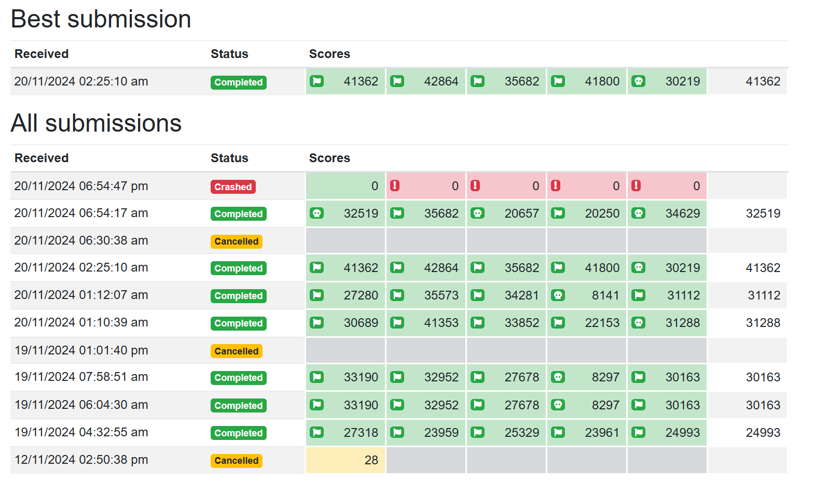
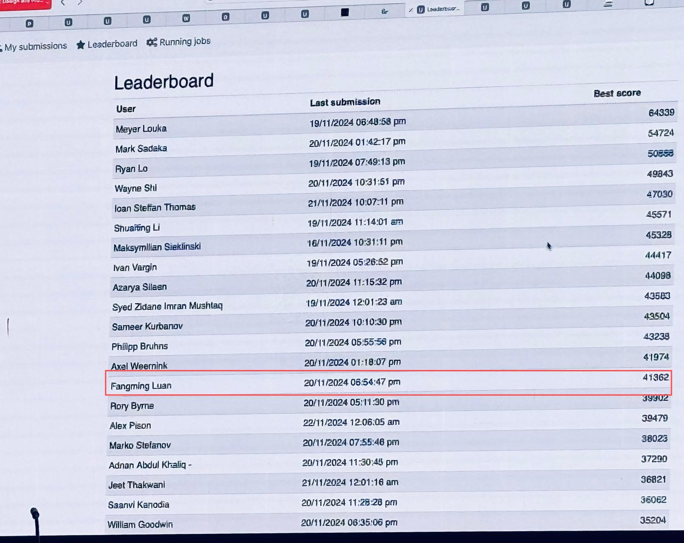
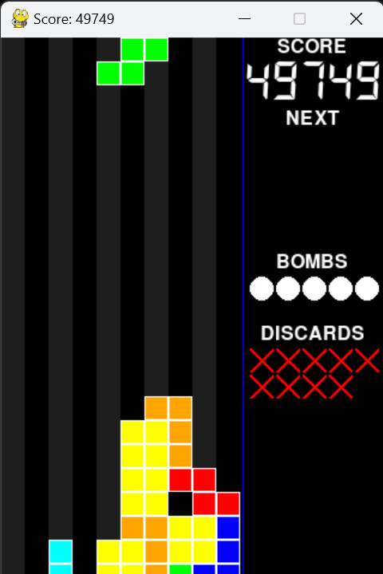

# Tetris_Ming

## About the game

Before each game starts, you can preconfigure the seed to used for execution by modifying the `DEFAULT_SEED` in `constants.py`. 
`None` means that the seed is randomly selected.

```
DEFAULT_SEED = None
```

To run this game:

If you choose to run the program that **Pygame-based** interface, it offers better performance, delivering a more detailed and smoother graphics:  
(NOTE: You need to install `Pygame` library on your computer first.You can do this by typing this command in the terminal:`pip --user install pygame`. )

```
python visual-pygame.py
```
Also, you can run the program that **Tkinter-based** interface. There's no need to download any libraries, as this's a built-in Python library.
```
python visual.py
```
You can also run any of the interfaces above in manual mode by adding the flag `-m` at the end of command.

There are several versions I've written and uploaded, each with slight differences in the algorithm and values of parameters. 
Before running , confirm that the file name you intend to run is imported in file `visual-pygame.py` of `visual.py`
```
from  /**EDIT HERE**/ import Player, SelectedPlayer
```

## About my algorithms

### Evaluation Function or  Heuristic Search...?

Before each the block falls, simulate all possible final position and rotations of the block, taking into account the potential drop positions and rotation modes. Keep a record of the process using a list, then evaluate te situation based on a scoring system(will be outlined later). Ultimately, select the option with the highest score to execute.

The game has ten columns, and each block has at most four different rotations, so there are a maximum of 10 * 4 = 40 possible drop scenarios for each block. This can be implemented through nested loops that track the operations and scoring for each scenarios.


### Predict two steps

Based on the algorithms mentioned above, assess the situation after the drop of two blocks, rather than evaluating just one block.

### Keep the first column empty
Create space for the "I" block, allowing it to clear multiple lines when it appears. This is essential for the 1600 points gained from clearing 4 lines at once.

### Heuristics
- 1 The change of maximum height 
- 2 Number of holes
- 3 bumpiness (surface flatness)
- 4 lines cleared at once
- 5 Number of consecutive rows where first column is empty 

NOTE: There shouldn't be too many heuristics, and some of them should dominate, with values much greater than the others.


Alright, all core ideas are above. I believe that the secret to achieving a high score is a scientific planning os these heuristic weights. So, if you were a mathematician/actuary/game balance designer, you'd probably get a higher score than us programmers. :)


## About my final score

My highest score before the server shut down was 41,362, ranking 14th. I can consistently achieve over 30,000, with a approximately 50% chance of hitting 40,000+.   






The best-performing versions are `player_mingv7.py`,`player_mingv11.py`,`player_mingv14.py`

`player_mingv7.py`:  
The evaluation function in this file does not yet include a reward for leaving the first column empty; it only offers some guidance before the iteration starts.   
By not including te first column as a possible drop position in the simulation, the block will naturally never fall into the first column.

Like this:
```
if max_height < 8 and diff_height != 4:
    start = 1 
else:
    start = 0 
```

`player_mingv11.py`:

`calculate_consecutive_lines()` introduces a reward mechanism for leaving the first column empty; but the guidance is removed.


`player_mingv14.py`:

Both of these two mechanisms are preserved concurrently.
The penalty for the occurrence of holes raised.


## Mumbling... : 
Future optimization: 
- Introduce a penalty for clearing only 1 or 2 lines at once.
- Dynamically adjust the weight of heuristics based on the current maximum height, rather than keeping it constant throughout...

If you have any better ideas, feel free to comment. **Thanks!!!**
